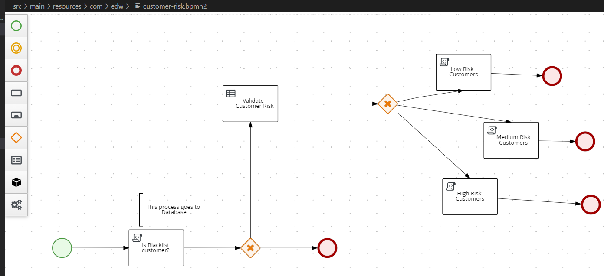

# Quarkus and BPMN Sample for Automatic Loan Approval

An integration of BPMN workflow using Kogito, and Quarkus Framework. This shows BPMN capability to validate and process REST API with a specific JSON format and gives response based on workflow.

## Risk Table


## Business Workflow


## Build
```
$ mvn clean package -s settings.xml
```

## Run
```
$ java -jar .\target\quarkus-app\quarkus-run.jar
```

## Test
```
$ curl  -X POST http://localhost:8080/customer_risk  \
    -H 'content-type: application/json'  \
    -H 'accept: application/json'   \
    -d '{"salary":500, "age": 15}'
    
{"id":"c4fcc5eb-9aab-4c99-8620-5ff1c27be79e","risk":"High","salary":500,"age":15,"status":"Loan is Rejected because Customer is High Risk"} 
    
```

## Endpoints
Open `http://localhost:8080/q` from web browser to see all the BPMN endpoints.

## Unit Tests
```java
    @Test
    public void testHighRiskCustomer() {
        given()
                .body("{ \"age\": 15, \"salary\": 300 }")
                .contentType(ContentType.JSON)
                .when()
                .post("/customer_risk")
                .then()
                .statusCode(201)
                .body("'status'", equalTo("Loan is Rejected because Customer is High Risk"));
    }
```